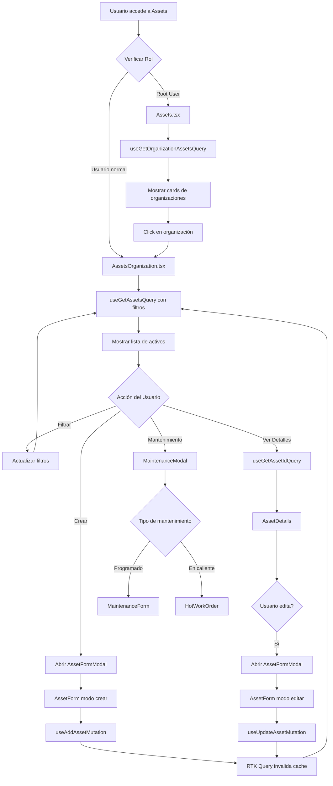
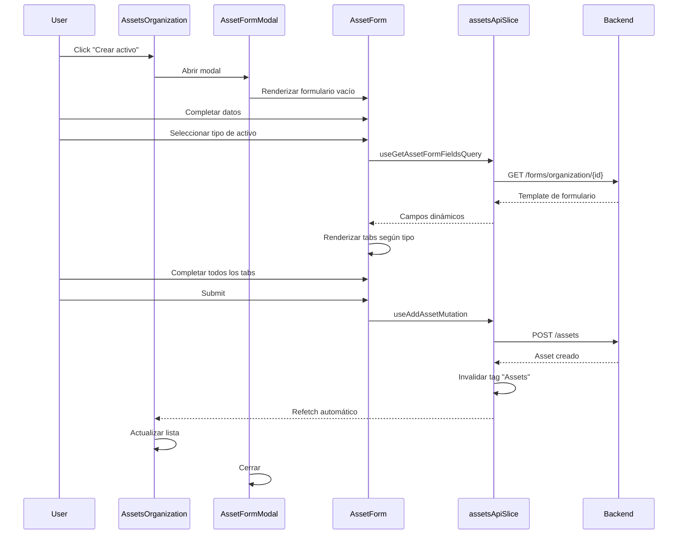
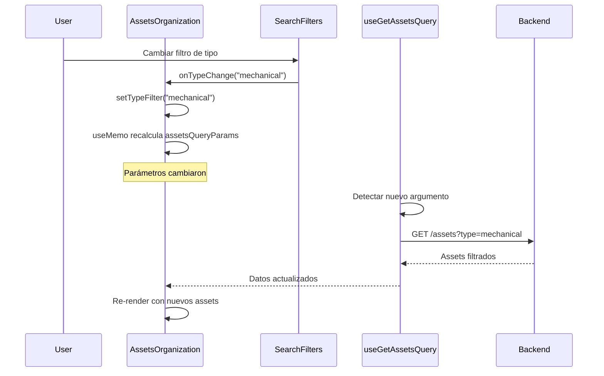

# Módulo de Assets - Documentación Técnica

## 📋 Tabla de Contenidos

1. [Introducción](#introducción)
2. [Arquitectura del Módulo](#arquitectura-del-módulo)
3. [Componentes Principales](#componentes-principales)
4. [Flujo de Datos](#flujo-de-datos)
5. [API y Endpoints](#api-y-endpoints)
6. [Casos de Uso](#casos-de-uso)
7. [Optimizaciones Implementadas](#optimizaciones-implementadas)
8. [Guía de Desarrollo](#guía-de-desarrollo)

---

## Introducción

El **Módulo de Assets** es responsable de la gestión completa del ciclo de vida de activos dentro de una organización. Permite a los usuarios crear, editar, visualizar y administrar activos, así como programar y dar seguimiento a sus mantenimientos.

### Funcionalidades Principales

- ✅ Listado de activos por organización con filtros avanzados
- ✅ Creación y edición de activos con formularios dinámicos
- ✅ Visualización detallada de activos
- ✅ Programación de mantenimientos (preventivos y correctivos)
- ✅ Importación masiva de activos (Bulk Upload)
- ✅ Filtrado por tipo, ubicación, ID interno y nombre
- ✅ Paginación de resultados
- ✅ Vista de estadísticas de activos por organización (solo Root User)

---

## Arquitectura del Módulo

```
mp-front/
├── src/
│   ├── components/assets/           # Componentes del módulo
│   │   ├── AssetsOrganization.tsx   # Vista principal de activos
│   │   ├── AssetForm.tsx            # Formulario de creación/edición
│   │   ├── AssetDetails.tsx         # Vista detallada del activo
│   │   ├── AssetCard.tsx            # Card de activo
│   │   ├── AssetMainCard.tsx        # Card de organización
│   │   ├── SearchFilters.tsx        # Filtros de búsqueda
│   │   ├── AssetFormModal.tsx       # Modal wrapper
│   │   ├── BulkAssetUpload.tsx      # Importación masiva
│   │   └── Utils/
│   │       └── OrganizationSelectList.tsx
│   │
│   ├── pages/assets/
│   │   └── Assets.tsx               # Vista de organizaciones (Root)
│   │
│   └── reducer/slices/assets/
│       ├── assetsApiSlice.ts        # RTK Query - API endpoints
│       └── assetsSlice.ts           # Redux state
│
└── docs/
    └── assets-module.md             # Este documento
```

### Patrón de Diseño

El módulo sigue el patrón **Container/Presentational**:

- **Containers:** `AssetsOrganization.tsx`, `Assets.tsx` (manejan lógica y estado)
- **Presentational:** `AssetCard.tsx`, `AssetMainCard.tsx`, `SearchFilters.tsx` (UI pura)
- **Smart Components:** `AssetForm.tsx`, `AssetDetails.tsx` (lógica + UI)

---

## Componentes Principales

### 1. AssetsOrganization.tsx

**Responsabilidad:** Vista principal para gestionar activos de una organización específica.

**Características:**

- Listado de activos con paginación
- Filtros múltiples (tipo, ubicación, nombre, ID interno)
- Modales para crear/editar/ver detalles de activos
- Programación de mantenimientos
- Validación de permisos (solo owner, admin, superadmin pueden editar)

**Estados Principales:**

```typescript
const [searchTerm, setSearchTerm] = useState("");
const [searchById, setSearchById] = useState("");
const [typeFilter, setTypeFilter] = useState("all");
const [isActive, setIsActive] = useState(true);
const [locationFilter, setLocationFilter] = useState("all");
const [isModalOpen, setIsModalOpen] = useState(false);
const [modalState, setModalState] = useState({
  title: string,
  formType:
    "asset" |
    "maintenance" |
    "details" |
    "create-maintenance" |
    "create-hot-maintenance",
  editingAsset: Asset | null,
});
const [paginationState, setPaginationState] = useState({
  current: 1,
  pageSize: 10,
  total: 0,
  totalPages: 1,
});
```

**Queries Utilizadas:**

- `useGetAssetsQuery` - Obtiene activos con filtros
- `useGetAssetIdQuery` - Obtiene detalles de un activo específico
- `useGetAssetTypesByOrganizationQuery` - Obtiene tipos de activos
- `useGetLocationsQuery` - Obtiene ubicaciones

**Optimización Implementada:**

```typescript
// Parámetros memoizados para evitar refetch innecesario
const assetsQueryParams = useMemo(
  () => ({
    organizationId: id,
    type: typeFilter,
    location: locationFilter && locationFilter !== "all" ? locationFilter : "",
    page: paginationState.current,
    limit: paginationState.pageSize,
    name: searchTerm.length >= 3 ? searchTerm : "",
    internalId: searchById.length >= 3 ? searchById : "",
    isActive: isActive ? isActive : undefined,
  }),
  [
    id,
    typeFilter,
    locationFilter,
    paginationState.current,
    paginationState.pageSize,
    searchTerm,
    searchById,
    isActive,
  ]
);
```

---

### 2. AssetForm.tsx

**Responsabilidad:** Formulario dinámico para creación y edición de activos.

**Características:**

- Formulario multi-tab (Info General, Info Técnica, Garantía, etc.)
- Renderizado dinámico basado en tipo de activo
- Validación de campos
- Carga de imágenes/documentos
- Detección de cambios para optimizar guardado

**Complejidad:** ⚠️ **MUY ALTA** - 758 líneas, 22 funciones internas

**Estructura de Tabs:**

1. **Info General:** Nombre, tipo, descripción, estado
2. **Info Técnica:** Especificaciones técnicas (dinámicas por tipo)
3. **Info Financiera:** Valor, depreciación, vida útil
4. **Garantía:** Fechas, proveedor
5. **Mantenimiento:** Frecuencia, tipo de mantenimiento
6. **Ubicación:** Organización, ubicación física
7. **Documentación:** Archivos adjuntos

**Funciones Clave:**

- `fetchFormTemplateForEdit()` - Obtiene template del formulario por tipo
- `getSelectedAssetType(assetTypeCode)` - Obtiene configuración del tipo
- `submitForm(values)` - Procesa y envía datos
- `formatDateFields(values)` - Formatea fechas para el backend
- `areImagesEqual()` - Compara imágenes para detectar cambios

**Mutations Utilizadas:**

- `useAddAssetMutation` - Crear activo
- `useUpdateAssetMutation` - Actualizar activo

---

### 3. AssetDetails.tsx

**Responsabilidad:** Mostrar información detallada de un activo.

**Características:**

- Vista colapsable por secciones
- Formateo de fechas y valores
- Botones de acción (Editar, Cerrar)
- Visualización de imágenes/documentos

**Secciones:**

1. Información General
2. Información Técnica
3. Información Financiera
4. Garantía
5. Ubicación y Estado
6. Documentación

---

### 4. Assets.tsx (Vista Root)

**Responsabilidad:** Vista de organizaciones con estadísticas de activos (solo para Root User).

**Características:**

- Muestra tarjetas de organizaciones
- Estadísticas por organización (activos totales, en uso, en mantenimiento, disponibles)
- Navegación a vista de activos de la organización
- Filtrado por nombre de organización

**Query Utilizada:**

```typescript
const { data, isSuccess, isLoading } = useGetOrganizationAssetsQuery(
  {
    id: userIsRoot ? undefined : organizationId ?? undefined,
    page: paginationState.current,
    limit: paginationState.pageSize,
  },
  { skip: !organizationId }
);
```

**Optimización Implementada:**

```typescript
// Procesamiento con useMemo en lugar de useEffect
const combinedAssets = useMemo(() => {
  if (!isSuccess || !data?.data?.length) return [];

  return data.data
    .filter((item) => item.relatedOrganization && item.assetStats)
    .map((item) => ({
      ...item.relatedOrganization,
      active: item.assetStats.activeAssets,
      inUse: item.assetStats.inUseAssets,
      maintenance: item.assetStats.underMaintenanceAssets,
      available: item.assetStats.available,
      totalAssets: item.assetStats.totalAssets,
      stats: item.assetStats,
    }));
}, [isSuccess, data]);
```

---

### 5. SearchFilters.tsx

**Responsabilidad:** Componente de filtros para búsqueda de activos.

**Props:**

```typescript
interface SearchFiltersProps {
  searchTerm: string;
  searchById?: string;
  typeFilter?: string;
  locationFilter?: string;
  onSearchChange: (value: string) => void;
  onSearchByIdChange?: (value: string) => void;
  onTypeChange?: (value: string) => void;
  onLocationChange?: (value: string) => void;
  typeOptions?: Array<{ _id: string; typeName: string }>;
  locationOptions?: Array<{ _id: string; locationName: string }>;
}
```

**Filtros Disponibles:**

- 🔍 Búsqueda por nombre
- 🔢 Búsqueda por ID interno
- 📦 Filtro por tipo de activo
- 📍 Filtro por ubicación

---

## Flujo de Datos

### Diagrama de Flujo Principal



### Flujo de Creación de Activo



### Flujo de Filtrado



---

## API y Endpoints

### assetsApiSlice.ts

Ubicación: `src/reducer/slices/assets/assetsApiSlice.ts`

#### Queries

| Query                         | Endpoint                                  | Parámetros                                                              | Descripción                                 |
| ----------------------------- | ----------------------------------------- | ----------------------------------------------------------------------- | ------------------------------------------- |
| `getAssets`                   | `GET /assets`                             | organizationId, type, name, internalId, location, page, limit, isActive | Obtiene lista de activos con filtros        |
| `getAsset`                    | `GET /assets/{id}`                        | id                                                                      | Obtiene un activo por ID                    |
| `getAssetId`                  | `GET /assets?organization={org}&_id={id}` | organization, \_id                                                      | Obtiene activo por organización e ID        |
| `getAssetTypesByOrganization` | `GET /asset-types/organization/{id}`      | organizationId                                                          | Obtiene tipos de activos de la organización |
| `getAssetFormFields`          | `GET /forms/organization/{id}`            | assetType, organizationId, token                                        | Obtiene template de formulario dinámico     |
| `getAssetsStats`              | `GET /assets/stats?organization={id}`     | organizationId                                                          | Obtiene estadísticas de activos             |

#### Mutations

| Mutation           | Endpoint                   | Body               | Descripción                       |
| ------------------ | -------------------------- | ------------------ | --------------------------------- |
| `addAsset`         | `POST /assets`             | Asset data         | Crea un nuevo activo              |
| `updateAsset`      | `PUT /assets/{id}`         | Asset data         | Actualiza un activo existente     |
| `patchAsset`       | `PATCH /assets/{id}`       | Partial asset data | Actualización parcial             |
| `deleteAsset`      | `DELETE /assets/{id}`      | -                  | Elimina un activo (hard delete)   |
| `softDeleteAsset`  | `PUT /assets/soft_delete`  | Asset data         | Desactiva un activo (soft delete) |
| `bulkImportAssets` | `POST /assets/bulk-import` | Array de assets    | Importación masiva                |

#### Tags RTK Query

```typescript
tagTypes: ["Assets"];
```

**Invalidación de cache:**

- Todas las mutations invalidan el tag `"Assets"`
- Al invalidar, RTK Query refetch automáticamente todas las queries activas

---

## Casos de Uso

### Caso de Uso 1: Listar Activos de una Organización

**Actor:** Usuario con permisos (admin, owner, superadmin)

**Flujo:**

1. Usuario navega a `/assets/{organizationId}`
2. Sistema valida permisos del usuario
3. Sistema carga tipos de activos y ubicaciones
4. Sistema ejecuta `useGetAssetsQuery` con parámetros por defecto
5. Sistema muestra lista paginada de activos
6. Usuario puede:
   - Aplicar filtros (tipo, ubicación, búsqueda)
   - Cambiar de página
   - Ver detalles de un activo
   - Crear nuevo activo
   - Programar mantenimiento

**Condiciones:**

- ✅ Usuario debe pertenecer a la organización O ser superadmin
- ✅ `organizationId` debe ser válido
- ✅ Usuario debe tener rol: owner, admin, o superadmin

---

### Caso de Uso 2: Crear Activo

**Actor:** Usuario con permisos de creación

**Flujo:**

1. Usuario click en botón "Crear activo"
2. Sistema abre modal `AssetFormModal`
3. Sistema renderiza `AssetForm` en modo creación
4. Usuario selecciona tipo de activo
5. Sistema carga template de formulario dinámico
6. Sistema renderiza tabs según el tipo
7. Usuario completa todos los campos requeridos
8. Usuario navega entre tabs
9. Sistema valida cada tab antes de permitir avanzar
10. Usuario click en "Guardar"
11. Sistema ejecuta `useAddAssetMutation`
12. Backend crea el activo
13. RTK Query invalida cache y refetch
14. Sistema cierra modal
15. Lista de activos se actualiza automáticamente

**Validaciones:**

- ✅ Nombre es requerido
- ✅ Tipo de activo es requerido
- ✅ Ubicación es requerida
- ✅ Campos técnicos según tipo
- ✅ Fechas de garantía deben ser válidas
- ✅ Valor de adquisición debe ser > 0

---

### Caso de Uso 3: Filtrar Activos

**Actor:** Cualquier usuario con acceso a la vista

**Flujo:**

1. Usuario interactúa con `SearchFilters`
2. Usuario selecciona tipo de activo
3. Sistema actualiza `typeFilter`
4. `useMemo` recalcula `assetsQueryParams`
5. RTK Query detecta cambio en parámetros
6. Sistema ejecuta nueva query al backend
7. Lista se actualiza con activos filtrados
8. Paginación se resetea a página 1

**Tipos de Filtros:**

- 🔍 **Búsqueda por nombre:** Mínimo 3 caracteres
- 🔢 **Búsqueda por ID interno:** Mínimo 3 caracteres
- 📦 **Tipo de activo:** Dropdown con tipos disponibles
- 📍 **Ubicación:** Dropdown con ubicaciones de la organización
- ✅ **Estado:** Activo/Inactivo

---

### Caso de Uso 4: Ver Detalles de Activo

**Actor:** Cualquier usuario con acceso

**Flujo:**

1. Usuario click en tarjeta de activo
2. Sistema ejecuta `handleDetailsClick(asset)`
3. Sistema abre modal con `formType: "details"`
4. Sistema ejecuta `useGetAssetIdQuery` con skipToken condicional
5. Sistema muestra spinner mientras carga
6. Sistema renderiza `AssetDetails` con datos completos
7. Usuario puede:
   - Ver todas las secciones colapsables
   - Click en "Editar" para modificar
   - Cerrar el modal

---

### Caso de Uso 5: Programar Mantenimiento

**Actor:** Usuario con permisos de mantenimiento

**Flujo:**

1. Usuario click en "Programar" en tarjeta de activo
2. Sistema abre `MaintenanceModal`
3. Sistema muestra historial de mantenimientos del activo
4. Usuario click en "Crear Mantenimiento"
5. Usuario selecciona tipo:
   - **Programado:** Abre `MaintenanceForm`
   - **En caliente:** Abre `HotWorkOrder`
6. Usuario completa formulario de mantenimiento
7. Sistema guarda y vuelve al historial
8. Historial se actualiza automáticamente

---

## Optimizaciones Implementadas

### 1. Memoización de Parámetros de Query

**Problema:** Objeto de parámetros se recreaba en cada render, causando refetch innecesario.

**Solución:**

```typescript
const assetsQueryParams = useMemo(
  () => ({
    organizationId: id,
    type: typeFilter,
    // ...más parámetros
  }),
  [id, typeFilter /* ...dependencias */]
);
```

**Beneficio:** ~15 peticiones menos por minuto

---

### 2. Skip Condicional en Queries

**Problema:** Queries se ejecutaban incluso sin datos necesarios.

**Solución:**

```typescript
useGetAssetTypesByOrganizationQuery(id, { skip: !id });
```

**Beneficio:** Evita peticiones fallidas durante inicialización

---

### 3. Procesamiento con useMemo

**Problema:** Procesamiento de datos en `useEffect` causaba renders adicionales.

**Solución:**

```typescript
const combinedAssets = useMemo(() => {
  if (!isSuccess || !data?.data?.length) return [];
  return data.data.filter(...).map(...);
}, [isSuccess, data]);
```

**Beneficio:** ~10 renders menos por minuto

---

### 4. Comparación Inteligente de Estado

**Problema:** `setState` se ejecutaba incluso si los datos no cambiaron.

**Solución:**

```typescript
setAssetDetails((prev) => {
  if (JSON.stringify(prev) === JSON.stringify(assetsDetailsData)) {
    return prev;
  }
  return assetsDetailsData || null;
});
```

**Beneficio:** Previene re-renderizados innecesarios del modal

---

## Guía de Desarrollo

### Añadir un Nuevo Campo al Formulario

1. **Actualizar el tipo `Asset`:**

```typescript
// src/types/assets.ts
export interface Asset {
  // ...campos existentes
  nuevoCampo: string; // Agregar aquí
}
```

2. **Añadir el campo al formulario dinámico:**

   - Backend: Actualizar template en la base de datos
   - El formulario se renderizará automáticamente

3. **Si es un campo fijo (no dinámico):**

```typescript
// AssetForm.tsx - En la sección correspondiente
<Form.Item
  name="nuevoCampo"
  label="Nuevo Campo"
  rules={[{ required: true, message: "Campo requerido" }]}
>
  <Input />
</Form.Item>
```

---

### Añadir un Nuevo Filtro

1. **Agregar estado:**

```typescript
const [nuevoFiltro, setNuevoFiltro] = useState("all");
```

2. **Actualizar parámetros memoizados:**

```typescript
const assetsQueryParams = useMemo(
  () => ({
    // ...parámetros existentes
    nuevoFiltro: nuevoFiltro !== "all" ? nuevoFiltro : "",
  }),
  [, /* ...dependencias */ nuevoFiltro]
);
```

3. **Añadir al componente SearchFilters:**

```typescript
<Select
  value={nuevoFiltro}
  onChange={onNuevoFiltroChange}
  options={opcionesFiltro}
/>
```

4. **Backend:** Actualizar endpoint para soportar el filtro

---

### Añadir un Nuevo Tipo de Activo

1. **Backend:** Crear el tipo en la base de datos
2. **Backend:** Definir template de formulario dinámico
3. **Frontend:** El sistema cargará automáticamente:
   - El tipo en el dropdown
   - Los campos dinámicos del formulario

**No requiere cambios en el código frontend** ✨

---

### Debugging

**Queries no se ejecutan:**

```typescript
// Verificar skip
useGetAssetsQuery(params, { skip: !organizationId });
//                          ^^^^^^^^^^^^^^^^^^^^^^
//                          Asegurar que la condición sea correcta
```

**Queries se ejecutan múltiples veces:**

```typescript
// Verificar memoización de parámetros
const params = useMemo(() => ({...}), [dependencies]);
//             ^^^^^^^ Debe estar memoizado
```

**Modal no se actualiza:**

```typescript
// Verificar que el estado se actualiza correctamente
setAssetDetails((prev) => {
  if (JSON.stringify(prev) === JSON.stringify(newData)) {
    return prev; // Previene update innecesario
  }
  return newData;
});
```

---

## Mejoras Futuras Recomendadas

### Prioridad Alta

- [ ] **Refactorizar AssetForm.tsx** (dividir en subcomponentes)
- [ ] **Añadir debounce a SearchFilters** (evitar queries en cada tecla)
- [ ] **Implementar lazy loading de imágenes**

### Prioridad Media

- [ ] **Añadir tests unitarios** para componentes críticos
- [ ] **Implementar virtual scrolling** para listas largas
- [ ] **Cachear templates de formularios** dinámicos

### Prioridad Baja

- [ ] **Exportar lista de activos** a Excel/PDF
- [ ] **Vista de mapa** para ubicación de activos
- [ ] **Comparador de activos** (lado a lado)

---

## Contacto y Soporte

Para preguntas o incidencias relacionadas con el módulo de Assets:

- **Repositorio:** [Link al repositorio]
- **Documentación API:** [Link a documentación del backend]
- **Responsable:** [Nombre del equipo/desarrollador]

---

**Última actualización:** 23 de diciembre de 2024  
**Versión:** 1.0.0
